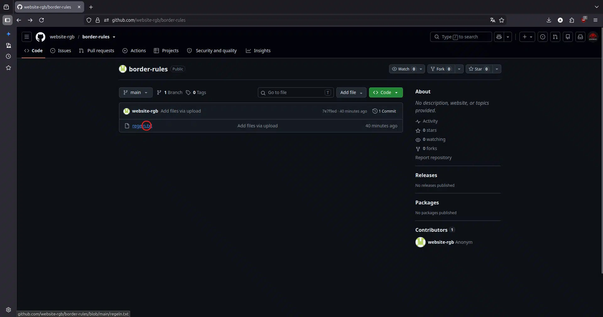
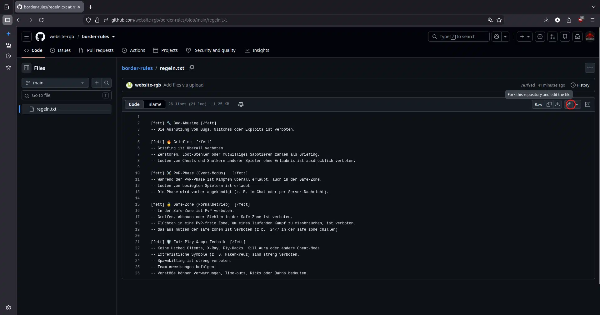
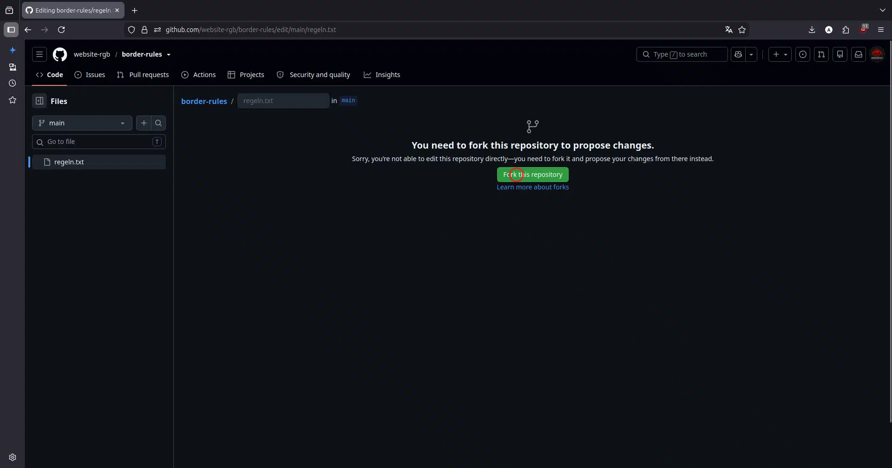
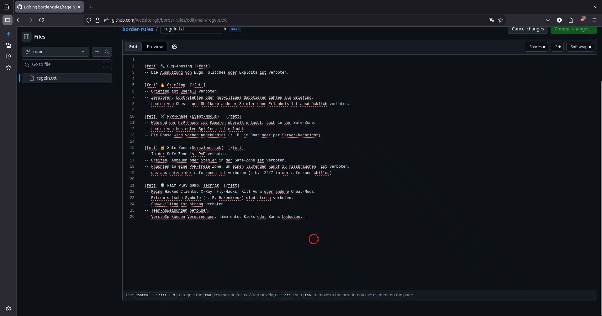
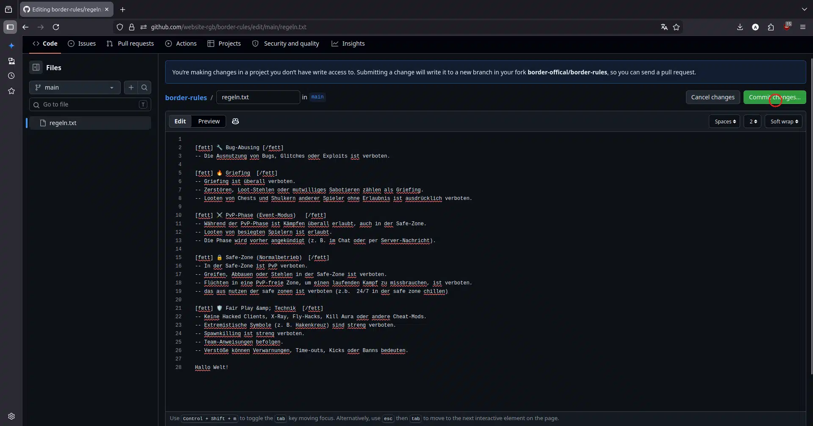
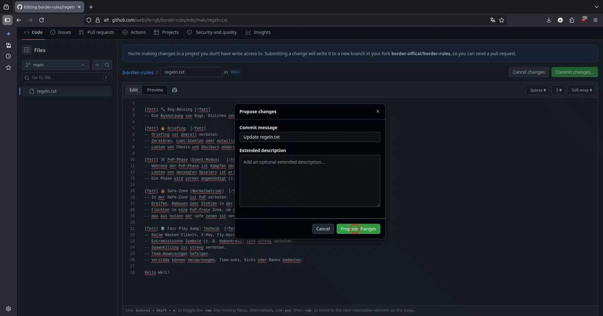
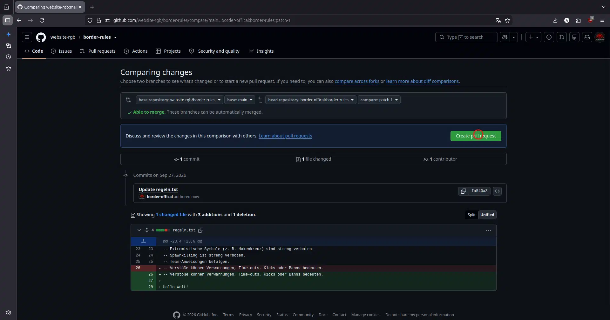
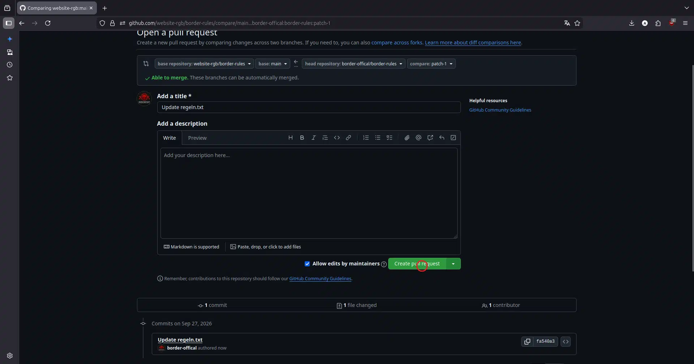
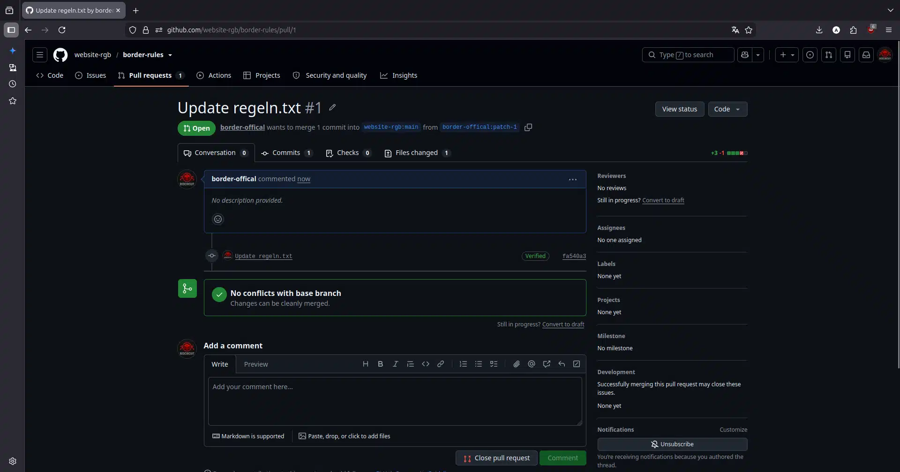

# Willkommen bei border-rules!

_Auf dieser Seite kannst du die Regeln für Border anpassen!_

|      Anfang (wie die Formatierung beginnt)      |            Funktion (was es macht)             | Ende (wie die Formatierung beendet wird)     |
| :----------------------------------------------: | :----------------------------------------------: | :-------------------------------------------- |
|                     `[fett]`                      |              macht den Text fett                | `[/fett]`                                     |
|                        `--`                       |         erstellt einen Aufzählungspunkt          | besitzt kein Ende, da es nur ein Symbol erzeugt |

*Wichtig: Nach dem Anfang der Formatierung muss ein Leerzeichen stehen (z. B. `[fett] ` statt `[fett]`), und vor dem Ende der Formatierung muss ebenfalls ein Leerzeichen stehen (z. B. ` [/fett]` statt `[/fett]`).*

## Wie man eine Änderung einreicht

*Klicke auf die Datei `regeln.txt`.*

*Klicke oben rechts auf den kleinen Stift, um die Datei zu bearbeiten.*

*Klicke auf „Fork Repository", um deine eigene Version zu erstellen.*

*Hier kannst du die Regeln nach Belieben ändern.*

*Klicke auf „Commit Changes", um deine Änderungen zu speichern.*

*Klicke hier auf „Propose changes", um deine Änderungen final zu bestätigen.*

*Klicke auf „Create Pull Request", um die Änderungen anzufragen, damit sie offiziell übernommen werden können.*

*Klicke erneut auf „Create Pull Request".*

*Jetzt hast du mir eine Anfrage mit deinen Änderungen geschickt. Sie werden geprüft und gegebenenfalls offiziell übernommen.*